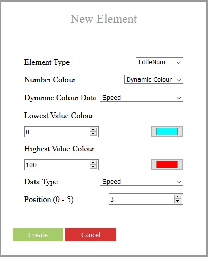

# EUC Speedo(meter)
A wearable speedometer for Electric Unicycles (EUCs), based on ESP32, and using the Arduino core and developed with PlatformIO on VSCode.

This is intended to be run on a TTGO T-Wristband.

It is intended to support all major brands of Electric Unicycle, and to connect directly, without requiring an app or other device.
Currently only Gotway/Begode, Veteran, and Kingsong wheels are supported, however.

## Get Started
When your new TTGO T-Wristband arrives, it will have the [manufacturer firmware](https://github.com/Xinyuan-LilyGO/LilyGo-T-Wristband) installed on it. In order to run the EUC Speedo firmware instead, you will need to flash it to the device using a programmer.

After the initial flash, software updates can be be uploaded over a WiFi connection using the app's builtin Over the Air (OTA) updater.

Once the EUC Speedo is up and running on the device, a double press on the button will activate the internal WiFi access point, connect to that and use a web browser to navigate to the IP address on the screen. You will see the settings page and links to configure the UI. From there you can choose what data is displayed on the screen and how, and also change what the button does.

Alternatively, a double press on the button will activate a bluetooth scan, causing it to connect to any Gotway/Begode, Veteran or Kingsong EUCs that are active nearby, and the default UI will display the speed of the connected device.

## Uploading Firmware
### Using a Programmer

- Download the [latest EUC Speedo binaries](https://github.com/ihatechoosingusernames/EUCSpeedo/releases/) and find the file called '0x00.bin'
- Follow the instructions for opening the device and attaching a programmer, but be careful; The T-Wristband has a very weak retainer clip which is prone to breaking when the case is opened, and the battery leads are also very easy to break when removing the mainboard from the case.

- Once the programmer is attached to the device, connect to your PC via either the USB-C or USB micro ports on the programmer.

- Next, choose a flashing tool.
  * For Windows there is a GUI based flashing tool called [ESP32 Flash Download Tool](http://iot-bits.com/esp32/esp32-flash-download-tool-tutorial/).
  * For Mac and Linux there is [esptool](https://github.com/espressif/esptool), a Python based command line application. This can also work on Windows, but it requires Python to be installed first.

#### ESP32 Flash Download Tool (Windows Only)
- [Download](https://www.espressif.com/sites/default/files/tools/flash_download_tool_v3.8.7.zip) the flash tool and extract the zip file.
- Run the application.
- Select ESP32 from the dropdown and click OK.

- Select the EUC Speedo file called '0x00.bin' in the first input area, make sure the checkbox to the left of it is ticked, and set the offset box to the right of it to 0x00.

- Select the correct COM Port from the dropdown.
- Press the 'Start' button, and wait for the upload to finish.
- The device should restart and display the default EUC Speedo screen.

#### Esptool (Cross Platform)
- Open a terminal, and run the command `pip install esptool`
- Once the package has installed, run the command `esptool --baud 460800 --before default_reset --after hard_reset write_flash -z --flash_mode dio --flash_freq 40m --flash_size detect 0x00 path/to/0x00.bin`, replacing `path/to/0x00.bin` with the path to the binary downloaded earlier.
- The device should restart and display the default EUC Speedo screen.

After the initial flash, it is well worth keeping the programmer in case of errors in the firmware, which can make OTA updates impossible.

### OTA Update
- Download the [latest EUC Speedo binaries](https://github.com/ihatechoosingusernames/EUCSpeedo/releases/) and find the files called 'firmware.bin' and possibly 'spiffs.bin'. Not all updates will include 'spiffs.bin'.
- Activate the EUC Speedo's internal web server, and click on the 'upload' button.
- Select 'firmware.bin' and (if included) 'spiffs.bin'.
- Wait for the upload to finish, and the device will restart.

## Settings Page

By default, a double press on the button will activate the internal web server, accessible through a WiFi access point called 'EUC-Speedo'. Once activated, the LED will flash, and the IP address of the server will be printed to the screen. Connecting to the access point and navigating to the IP address in a web browser will display the general settings page.

The basic settings and OTA updates are available from this page, as well as the UI Settings.

### UI Settings
The app supports multiple UI screens, all of which are completely configurable. The list in the general settings page allows the creation and deletion of these UI screens, as well as the ability to change their order.

Pressing 'edit' on one of these screens will open the UI Settings page.

On the left are the general settings for this screen:
- Only If Connected: It will only be possible to navigate to this UI screen when an EUC is connected.
- On (Single/Double/Long) Press: The action to take when this screen is active and the button is pressed once/twice/for more than three seconds.
- Sleep Timeout: How long this screen will stay on before going to sleep. In sleep mode the screen is deactivated, but the device remains connected via bluetooth. Any touch input will wake it up. The sleep timeout is deactivated with a value of 0.
- Off Timeout: How long this screen will stay on before the device switches off. The timeout will deactivate if the device is connected via Bluetooth, if the config server is active, or if it is configured with a value of 0.

In the center is the Draw Queue:

Each UI element is listed in the order that they are drawn. Elements further down the list are 'in front' of the previous elements. Their order can be changed or they can be deleted, which will be immediately updated on the device's screen. The 'Add Element' button opens the UI Element creation form. Occasionally an 'empty' type may appear. This is an error type and won't affect the UI.

Selecting from each of the drop downs in order, a UI Element can be configured to display data on the screen. Dynamic colour types allow any colour in the UI element to change based on a given data type.

The available data types are:
- Speed
- Voltage
- Current
- Power (Watts / 100)
- Temperature
- Alarm Level
- Trip Distance
- Total Distance
- Battery (percent)
- Watch Battery (percent)
- Second
- Minute
- Hour
- Day
- Month
- Year

On the right are the test data.

Each data type that is displayed by a UI element on this screen will be displayed in the list, allowing the user to update them and see the results in real time on the device.